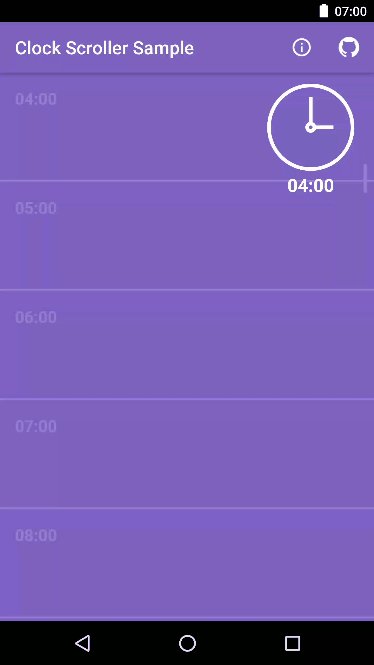

# Clock Scroller

A cool animated RecyclerView clock face scroller handle inspired by the following [MaterialUp](https://material.uplabs.com/) submission ~>

<a href="https://material.uplabs.com/posts/codepen-scrolling-clock">https://material.uplabs.com/posts/codepen-scrolling-clock</a>

* Scroll handle shows animated clock face when scrolling
* Clock face animates to hours
* Still a **WORK IN PROGRESS** so please submit a pull request if you can improve/find bugs! :-)

<p>
<a href="https://play.google.com/store/apps/details?id=uk.co.barbuzz.clockscroller.sample"></a>
</p>
<p>

</p>
  
<!---->

### Setup
To use **Clock Scroller** in your projects, simply add the library as a dependency to your build.

##### Gradle
```
dependencies {
  compile 'uk.co.barbuzz:clockscroller:0.0.1'
}
```

##### Maven
```
<dependency>
  <groupId>uk.co.barbuzz.clockscroller</groupId>
  <artifactId>clockscroller</artifactId>
  <version>0.0.1</version>
  <type>pom</type>
</dependency>
```

Alternatively you can directly import the /library project into your Android Studio project and add it as a dependency in your build.gradle.

The library is currently configured to be built via Gradle only. It has the following dependencies:

* RecyclerView              - com.android.support:recyclerview-v7
* Compiled SDK Version      - nougat-24
* Minimum SDK Version       - jelly bean-16

### Usage
For more detailed code example to use the library, Please refer to the `/sample` app.

Add the `DateGetter` interface to your RecyclerView and implement `getDateFromAdapter()` method to 
return a date from the position of the data set in your RecyclerView e.g.

```
@Override
public Date getDateFromAdapter(int pos) {
    Calendar cal = Calendar.getInstance();
    cal.set(Calendar.HOUR_OF_DAY, Integer.valueOf(dataSet.get(pos).time.substring(0,2)));
    cal.set(Calendar.MINUTE, 0);
    return cal.getTime();
}
```

Then create your `RecyclerView` instance with a `FastScroller` instance and pass in the `RecyclerView` to it e.g.

```
mContactsRecyclerView = (RecyclerView) findViewById(R.id.contacts_recycler_view);
mContactsRecyclerView.setLayoutManager(new LinearLayoutManager(this));
mAdapter = new RecyclerViewAdapter(calendarTimeSlotsList, this);
mContactsRecyclerView.setAdapter(mAdapter);

FastScroller fastScroller = (FastScroller) findViewById(R.id.fast_scroller_view);
fastScroller.setRecyclerView(mContactsRecyclerView);
```

You'll also need to add the `FastScroller` view below your `RecyclerView` as a custom view to your layout e.g.

```
<uk.co.barbuzz.clockscroller.FastScroller
        android:id="@+id/fast_scroller_view"
        android:layout_width="wrap_content"
        android:layout_height="match_parent"
        android:layout_marginTop="10dp"
        android:layout_marginBottom="10dp"
        android:layout_alignParentRight="true"
        android:visibility="visible"
        app:clockFaceColor="@android:color/transparent"
        app:clockEdgeColor="@color/clock_edge"
        app:clockScrollBarColor="@color/colorPrimaryDark"
        app:clockScrollBarSelectedColor="@color/text_row"/>
```

You can then either set the view parameters in xml as above or do it programmatically e.g.

```
FastScroller fastScroller = (FastScroller) findViewById(R.id.fast_scroller_view);
fastScroller.setClockEdgeColor(getResources().getColor(R.color.clock_edge));
fastScroller.setClockFaceColor(getResources().getColor(android.R.color.transparent));
fastScroller.setClockLineWidth(getResources().getDimension(R.dimen.clock_stroke_width));
fastScroller.setClockScrollBarColor(getResources().getColor(R.color.colorPrimaryDark));
fastScroller.setClockScrollBarSelectedColor(getResources().getColor(R.color.text_row));
```

### TODO
1. Work out how to add minutes to the scrolling clock
2. Iron out any bugs

### Thanks

This library has been made by pulling together two other open source libraries to get what I needed at the time. So huge thanks to the following libraries which this is based on.

* Sticky Index by [edsilfer](https://github.com/edsilfer) - [https://github.com/edsilfer/sticky-index](https://github.com/edsilfer/sticky-index)
* Clock Drawable Animation by [evelyne24](https://github.com/evelyne24) - [https://github.com/evelyne24/ClockDrawableAnimation](https://github.com/evelyne24/ClockDrawableAnimation)

### Licence
```
Copyright (c) 2016 Andy Barber

Licensed under the Apache License, Version 2.0 (the "License");
you may not use this file except in compliance with the License.
You may obtain a copy of the License at

  http://www.apache.org/licenses/LICENSE-2.0

Unless required by applicable law or agreed to in writing, software
distributed under the License is distributed on an "AS IS" BASIS,
WITHOUT WARRANTIES OR CONDITIONS OF ANY KIND, either express or implied.
See the License for the specific language governing permissions and
limitations under the License.
```
